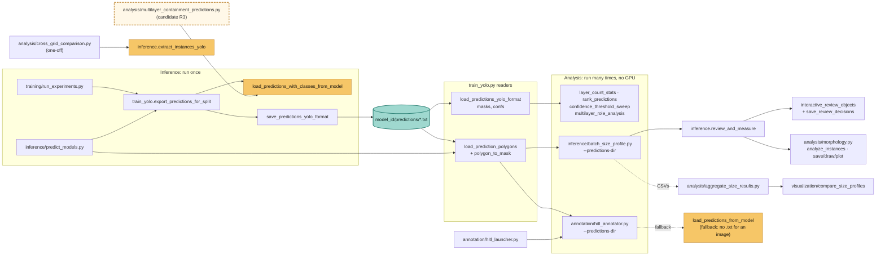

# Architecture: how the pieces connect

The core rule is **run inference once, analyze many times.** Models are loaded in one place, which writes prediction files. Everything downstream reads those files, so it needs no GPU or weights.

**Key:** amber = loads a model and runs inference · teal = prediction files · dashed outline = still runs live inference and is a cleanup candidate (see [`CLEANUP_CANDIDATES.md`](../CLEANUP_CANDIDATES.md)).

## Separate workflow
`embedding/` (DINO embeddings + clustering) is independent of this graph. It shares only `data_utils.prepare_all_layer_singleclass` (category map), the geometry in `analysis/multilayer_containment.py` (`classify_roles()`, `find_containment()` and its own `polygon_to_mask()`), and `training.monitor_run.get_gpu_info`. See `embedding/README.md`.

## History
The pre-cleanup layout (U-Net stack, live inference in profiling and annotation, package `__init__` side effects) is preserved at git tag `pre-cleanup`.
